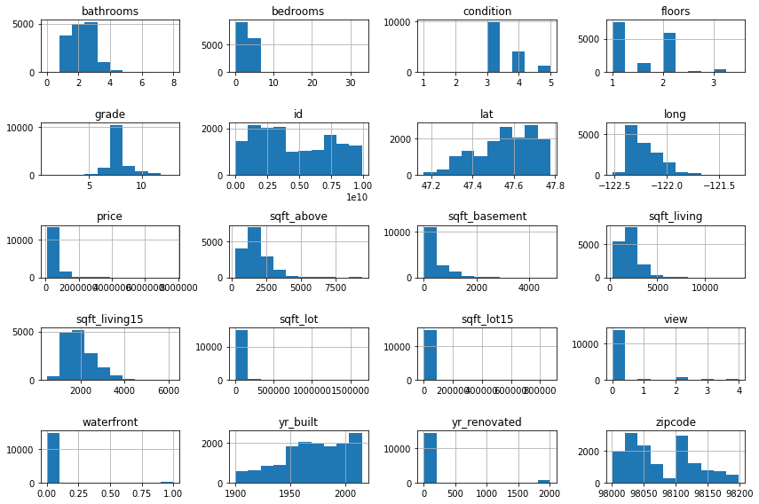

Welcome! In this notebook I look at a data set with houses and a range of features.
I will do some exploratory data analysis to learn a bit about the trends in the data.
Then I will try to make a regressor to predict the prices of the houses based on the features.

The point of this notebook is to illustrate my capabilities (and hopefully not lack thereof).
For that reason I will go very through the process very pedagogically.
So apologies to those who'd like for this to be more fast-paced :-)

So for those of you who'd like to follow along, go ahead and install Anaconda if you don't have it already.
You can download it from https://www.anaconda.com/distribution/.
Now go ahead and make a fresh conda environment:

`conda create -yn house_prices`

And let's install some of the packages that we will need for sure.

`conda install -yn house_prices pandas numpy seaborn scikit-learn`

And finaly we can go ahead and activate the environment.

`conda activate house_prices`

Great. Now that that's out of the way, let's jump into it!
We start by importing the newly installed modules

# Data exploration


```python
import numpy as np
import pandas as pd
import seaborn as sns
import matplotlib.pyplot as plt
```

The data that I will be using is the *House Sales in King County, USA* data set.
It is available on Kaggle at https://www.kaggle.com/harlfoxem/housesalesprediction.
After downloading it we can load it up and display it.


```python
house_data = pd.read_csv("kc_house_data.csv")
house_data.head()
```


<div>
<style scoped>
    .dataframe tbody tr th:only-of-type {
        vertical-align: middle;
    }

    .dataframe tbody tr th {
        vertical-align: top;
    }

    .dataframe thead th {
        text-align: right;
    }
</style>
<table border="1" class="dataframe">
  <thead>
    <tr style="text-align: right;">
      <th></th>
      <th>id</th>
      <th>date</th>
      <th>price</th>
      <th>...</th>
      <th>long</th>
      <th>sqft_living15</th>
      <th>sqft_lot15</th>
    </tr>
  </thead>
  <tbody>
    <tr>
      <td>0</td>
      <td>7129300520</td>
      <td>20141013T000000</td>
      <td>221900.0</td>
      <td>...</td>
      <td>-122.257</td>
      <td>1340</td>
      <td>5650</td>
    </tr>
    <tr>
      <td>1</td>
      <td>6414100192</td>
      <td>20141209T000000</td>
      <td>538000.0</td>
      <td>...</td>
      <td>-122.319</td>
      <td>1690</td>
      <td>7639</td>
    </tr>
    <tr>
      <td>2</td>
      <td>5631500400</td>
      <td>20150225T000000</td>
      <td>180000.0</td>
      <td>...</td>
      <td>-122.233</td>
      <td>2720</td>
      <td>8062</td>
    </tr>
    <tr>
      <td>3</td>
      <td>2487200875</td>
      <td>20141209T000000</td>
      <td>604000.0</td>
      <td>...</td>
      <td>-122.393</td>
      <td>1360</td>
      <td>5000</td>
    </tr>
    <tr>
      <td>4</td>
      <td>1954400510</td>
      <td>20150218T000000</td>
      <td>510000.0</td>
      <td>...</td>
      <td>-122.045</td>
      <td>1800</td>
      <td>7503</td>
    </tr>
  </tbody>
</table>
<p>5 rows × 21 columns</p>
</div>


Before we go any further we should split the data into training and testing data.
We wouldn't wanna spoil our opportunity to get a realistic estimate of our performance!


```python
# Set seed for reproducibility
np.random.seed(324976)

# Randomly pick 70% of the data as tranining points
df = house_data.sample(frac=0.7)

# Assign the remaining points to the test set
df_test = house_data[~house_data.index.isin(df.index)]

print(house_data.shape)
[d.shape for d in [df, df_test]]
```

    (21613, 21)


    [(15129, 21), (6484, 21)]


Okay, so far so good. We see that we have a total of 21,613 rows (or houses) of which we put away 30% for our test set.
Thus we have 15129 remaining points to learn from.

One of the first helpful things to do to gain insight into our data is to make some basic histograms.
To declutter the notebook, I've defined my plotting functions in the `plotting_functions.py` module.


```python
# Import custom histogram function
from plotting_functions import histogram

histogram(df=df)
```





Another useful first step is to call the `.info()` function 


```python
df.info()
```

    <class 'pandas.core.frame.DataFrame'>
    Int64Index: 15129 entries, 6969 to 5648
    Data columns (total 21 columns):
    id               15129 non-null int64
    date             15129 non-null object
    price            15129 non-null float64
    bedrooms         15129 non-null int64
    bathrooms        15129 non-null float64
    sqft_living      15129 non-null int64
    sqft_lot         15129 non-null int64
    floors           15129 non-null float64
    waterfront       15129 non-null int64
    view             15129 non-null int64
    condition        15129 non-null int64
    grade            15129 non-null int64
    sqft_above       15129 non-null int64
    sqft_basement    15129 non-null int64
    yr_built         15129 non-null int64
    yr_renovated     15129 non-null int64
    zipcode          15129 non-null int64
    lat              15129 non-null float64
    long             15129 non-null float64
    sqft_living15    15129 non-null int64
    sqft_lot15       15129 non-null int64
    dtypes: float64(5), int64(15), object(1)
    memory usage: 2.5+ MB


Now we have a little more information about the columns.
We have general info about the size and number of each type of room;
the year of which the house was built and renovated;
some qualitative notions of "condition" and "grade" as well as "view";
and information about the location in the form of coordinates and zipcode.

A few questions come to mind regarding the columns that are less clear.
What is the difference between sqft_living and sqft_living15 for example?
And what exactly is in the columns waterfront, condition, grade?
To answer these questions we can go back to Kaggle where we found the data.


```python

```
